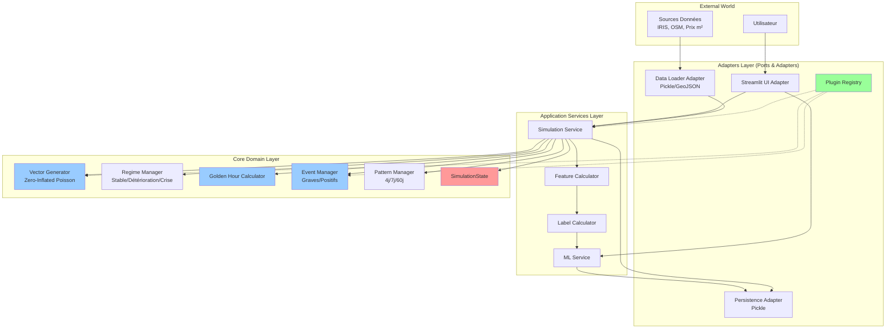
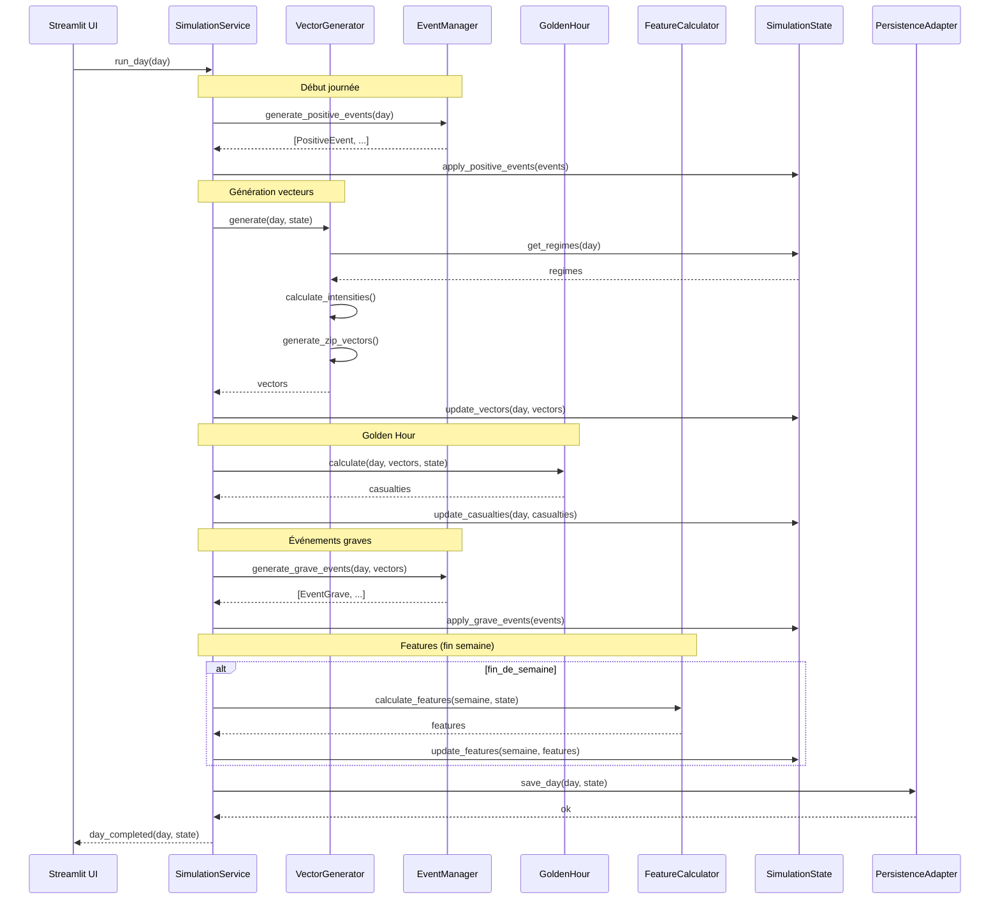
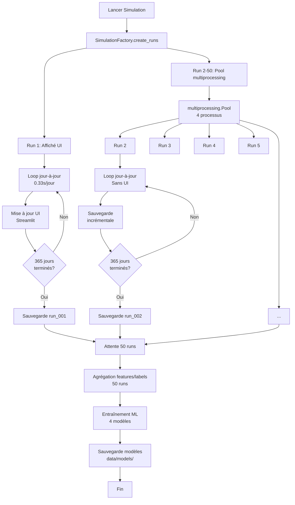

# Pompier-Risques-BMAD Architecture Document

**Version:** v2  
**Date:** 28 Janvier 2026  
**Auteur:** Architect (Winston)  
**Statut:** Validé (améliorations v2)

---

## Introduction

Ce document décrit l'architecture complète du système de simulation et prédiction des risques pour les pompiers de Paris (BSPP). L'architecture suit le principe de l'**Architecture Hexagonale (Ports & Adapters)** combinée à une **organisation hybride** pour équilibrer simplicité et extensibilité.

**Objectifs architecturaux:**
- **Extensibilité:** Plugins/modulateurs sans toucher le cœur (requirement PRD)
- **Modularité:** Remplacement données générées → vraies données BSPP (Phase 2)
- **Testabilité:** Simulation exécutable sans UI (headless)
- **Performance:** Calculs vectoriels optimisés (NumPy), parallélisation multi-runs
- **Maintenabilité:** Séparation claire des responsabilités
- **Robustesse:** Gestion d'erreurs complète, reprise après crash, validation config
- **Réactivité UI:** Interface réactive avec hover/tooltips pendant simulation

**Relation avec le PRD:**
Ce document implémente les décisions techniques validées dans `docs/technical-decisions.md` et répond aux requirements fonctionnels et non-fonctionnels du PRD v4.

**Relation avec la documentation technique:**
- `docs/formules.md` : Formules mathématiques et matrices
- `docs/modele-j1-et-generation.md` : Explication du modèle J+1
- `docs/technical-decisions.md` : Décisions techniques détaillées
- `docs/vector-convention.md` : Convention des vecteurs (bénin, moyen, grave)

**Shards d'architecture (BMAD v4):**
- `docs/architecture/testing-strategy.md` : Stratégie de tests validée
- `docs/architecture/dataflow.md` : Flux de données complets
- `docs/architecture/simulation-state.md` : Détails refactoring SimulationState
- `docs/architecture/error-handling.md` : Gestion d'erreurs et reprise
- `docs/architecture/ui-reactive.md` : UI réactive (hover/tooltips)
- `docs/architecture/config-validation.md` : Validation config au démarrage
- `docs/architecture/benchmarks.md` : Benchmarks et performance
- `docs/architecture/review.md` : Review critique (historique)
- `docs/architecture/impact-decoupage-1.4.4.md` : Analyse impact découpage Story 1.4.4 (matrices, variables d'état, patterns)

---

### Change Log

| Date | Version | Description | Author |
|------|---------|------------|--------|
| 28 Jan 2026 | v1 | Création architecture hexagonale avec organisation hybride | Architect |
| 28 Jan 2026 | v2 | Refactoring SimulationState, gestion erreurs, UI réactive, validation config, benchmarks | Architect |

---

## High Level Architecture

### Technical Summary

Le système adopte une **Architecture Hexagonale (Ports & Adapters)** avec une organisation **hybride** par domaine fonctionnel et responsabilité. Le cœur métier (génération de vecteurs, régimes cachés, Golden Hour, événements) est isolé des détails d'implémentation (Streamlit UI, persistance pickle, chargement de données). Cette séparation permet l'extensibilité via plugins/modulateurs sans modification du cœur, et facilite le remplacement des données générées par de vraies données BSPP en Phase 2. Les patterns de design choisis (Strategy pour scénarios, Factory pour événements, Plugin Registry pour extensibilité) garantissent la maintenabilité et la testabilité. La simulation est exécutable en mode headless (sans UI) pour les 49 runs silencieux, avec parallélisation via `multiprocessing`. Les calculs vectoriels utilisent NumPy pour performance optimale et compatibilité ML.

### High Level Overview

**Style architectural:** Architecture Hexagonale (Ports & Adapters) avec organisation hybride.

**Structure du repository:** Monorepo (tous les modules dans un seul dépôt).

**Architecture des services:** Application monolithique modulaire (pas de microservices pour MVP).

**Flux principal:**
1. **Pré-calculs (Epic 1):** Scripts génèrent données fixes (microzones, distances, vecteurs statiques, prix m², **matrices de corrélation** - Story 1.4.4.1) → pickles dans `data/source_data/`
2. **Simulation (Epic 2):** 
   - Chargement données pré-calculées (incluant matrices)
   - Boucle jour-à-jour: **évolution variables d'état** → génération vecteurs (avec matrices + patterns) → Golden Hour → morts/blessés → features → labels
   - Sauvegarde état par run dans `data/intermediate/run_XXX/`
   - 50 runs: 1 affiché (UI Streamlit), 49 silencieux (parallélisés)
3. **ML:** Après 50 runs, agrégation features/labels → entraînement modèles → sauvegarde dans `data/models/`
4. **Prédiction:** Chargement modèle → simulation 1 run → prédictions semaine 5+

**⚠️ NOUVEAU (Story 1.4.4):** Le flux J→J+1 inclut maintenant :
- **Évolution variables d'état** (trafic, incidents nuit, incidents alcool) - Story 1.4.4.2
- **Application matrices fixes** (intra-type, inter-type, voisin, saisonnalité) - Story 1.4.4.3
- **Intégration variables d'état** dans calcul probabilités - Story 1.4.4.4
- **Détection patterns** (4j→7j, 60j) - Story 1.4.4.5
- **Application patterns** dans calcul probabilités - Story 1.4.4.6

**Voir `docs/architecture/impact-decoupage-1.4.4.md` pour flux détaillé.**

**Décisions architecturales clés:**
- **Hexagonale:** Isolation cœur métier pour extensibilité (plugins, remplacement données)
- **Hybride:** Organisation par domaine (core/services/adapters) pour équilibre simplicité/extensibilité
- **SimulationState:** État global simple, sauvegardable/rechargeable (pickle)
- **Factory Pattern:** Création runs multiples avec sauvegarde incrémentale
- **Strategy Pattern:** Scénarios (pessimiste/moyen/optimiste) modulables
- **Plugin Registry:** Extensibilité sans toucher le cœur
- **Dependency Injection:** Testabilité et découplage

### High Level Project Diagram



**Légende:**
- 🔴 **Rouge:** État global (SimulationState)
- 🔵 **Bleu:** Cœur métier (Domain)
- 🟢 **Vert:** Extensibilité (Plugins)

---

## Architecture Layers

### Layer 1: Core Domain (Cœur Métier)

**Responsabilité:** Logique métier pure, indépendante des frameworks et I/O.

**Modules:**
- `src/core/generation/` : Génération vecteurs J+1 (Zero-Inflated Poisson, régimes cachés)
- `src/core/evolution/` : Évolution variables d'état dynamiques (trafic, incidents nuit, incidents alcool) - Story 1.4.4.2
- `src/core/probability/` : Calcul probabilités avec matrices fixes et variables d'état - Stories 1.4.4.3 + 1.4.4.4
- `src/core/golden_hour/` : Calcul Golden Hour (trajets, congestion, stress)
- `src/core/events/` : Événements graves et positifs (hierarchy + factory)
- `src/core/patterns/` : Patterns temporels (4j, 7j, 60j) - Détection et gestion Stories 1.4.4.5 + 1.4.4.6
- `src/core/state/` : SimulationState (état global) + DynamicState (variables d'état)

**Principes:**
- ✅ Aucune dépendance externe (pas de Streamlit, pickle, fichiers)
- ✅ Types Python purs (tuples, dicts, classes)
- ✅ Testable unitairement (mocking des dépendances)

**Exemple de structure:**
```
src/core/
├── generation/
│   ├── vector_generator.py      # Génération vecteurs J+1
│   ├── regime_manager.py         # Gestion régimes cachés
│   └── intensity_calculator.py  # Intensités calibrées
├── evolution/                    # NOUVEAU (Story 1.4.4.2)
│   ├── trafic_evolution.py      # Évolution trafic J→J+1
│   ├── nuit_evolution.py         # Évolution incidents nuit J→J+1
│   └── alcool_evolution.py       # Évolution incidents alcool J→J+1
├── probability/                  # NOUVEAU (Stories 1.4.4.3 + 1.4.4.4)
│   ├── matrix_applicator.py     # Application matrices fixes
│   └── probability_calculator.py # Calcul probabilités finales
├── golden_hour/
│   ├── golden_hour.py           # Calcul temps trajets
│   └── congestion.py            # Calcul congestion
├── events/
│   ├── event.py                  # Base Event (ABC)
│   ├── event_grave.py           # EventGrave (ABC)
│   ├── accident_grave.py       # AccidentGrave
│   ├── incendie_grave.py        # IncendieGrave
│   ├── agression_grave.py      # AgressionGrave
│   ├── positive_event.py        # PositiveEvent (ABC)
│   ├── fin_travaux.py           # FinTravaux
│   ├── nouvelle_caserne.py     # NouvelleCaserne
│   └── event_factory.py         # Factory création événements
├── patterns/                     # MODIFIÉ (Stories 1.4.4.5 + 1.4.4.6)
│   ├── pattern_detector.py      # NOUVEAU : Détection patterns 4j→7j, 60j
│   ├── pattern_manager.py        # MODIFIÉ : Gestion cycle de vie, limitation 3 max
│   ├── pattern_loader.py        # Interface chargement patterns
│   ├── pattern_4j.py            # Pattern court-terme 4j
│   ├── pattern_7j.py            # Pattern court-terme 7j
│   └── pattern_60j.py           # Pattern long-terme 60j
└── state/
    ├── simulation_state.py      # SimulationState (état global)
    └── dynamic_state.py         # NOUVEAU : Variables d'état (trafic, nuit, alcool)
```

---

### Layer 2: Application Services

**Responsabilité:** Orchestration des cas d'usage, coordination entre domain et adapters.

**Modules:**
- `src/services/simulation_service.py` : Orchestration simulation jour-à-jour
- `src/services/ml_service.py` : Entraînement et prédiction ML
- `src/services/feature_calculator.py` : Calcul 18 features hebdomadaires
- `src/services/label_calculator.py` : Calcul labels mensuels

**Principes:**
- ✅ Utilise le Core Domain (pas d'implémentation métier)
- ✅ Coordonne les adapters (I/O, UI)
- ✅ Dependency Injection pour testabilité

**Exemple:**
```python
# src/services/simulation_service.py
class SimulationService:
    def __init__(
        self,
        vector_generator: VectorGenerator,
        golden_hour: GoldenHourCalculator,
        event_manager: EventManager,
        state: SimulationState,
        data_loader: DataLoader,  # Adapter
        persistence: PersistenceAdapter  # Adapter
    ):
        self.vector_generator = vector_generator
        self.golden_hour = golden_hour
        self.event_manager = event_manager
        self.state = state
        self.data_loader = data_loader
        self.persistence = persistence
    
    def run_day(self, day: int) -> None:
        """Orchestre un jour de simulation."""
        # 1. Événements positifs (début journée)
        positive_events = self.event_manager.generate_positive_events(day)
        for event in positive_events:
            event.apply_effects(self.state)
        
        # 2. Génération vecteurs
        vectors = self.vector_generator.generate(day, self.state)
        self.state.update_vectors(day, vectors)
        
        # 3. Golden Hour
        casualties = self.golden_hour.calculate(day, vectors, self.state)
        self.state.update_casualties(day, casualties)
        
        # 4. Événements graves (après vecteurs)
        grave_events = self.event_manager.generate_grave_events(day, vectors)
        for event in grave_events:
            event.apply_effects(self.state)
        
        # 5. Sauvegarde incrémentale
        self.persistence.save_day(day, self.state)
```

---

### Layer 3: Adapters (Ports & Adapters)

**Responsabilité:** Interfaces avec le monde extérieur (UI, fichiers, données externes).

**Modules:**
- `src/adapters/ui/` : Streamlit UI adapter
- `src/adapters/data_loader/` : Chargement données pré-calculées (pickle, GeoJSON)
- `src/adapters/persistence/` : Sauvegarde état (pickle)
- `src/adapters/plugins/` : Plugin Registry

**Principes:**
- ✅ Implémente les interfaces définies dans Core/Application
- ✅ Isolé du cœur métier
- ✅ Facilement remplaçable (ex: BDD au lieu de pickle en Phase 2)

**Exemple:**
```python
# src/adapters/data_loader/pickle_loader.py
from src.core.patterns import PatternLoader  # Interface

class PicklePatternLoader(PatternLoader):
    """Adapter: charge patterns depuis fichiers pickle."""
    
    def __init__(self, patterns_dir: str):
        self.patterns_dir = patterns_dir
    
    def load_pattern_4j(self) -> dict:
        with open(f"{self.patterns_dir}/pattern_4j.json", 'r') as f:
            return json.load(f)
    
    def load_pattern_7j(self) -> dict:
        # ...
```

---

## Project Structure

### Directory Organization

```
Pompier-Risques-BMAD/
├── config/                          # Configuration YAML
│   └── config.yaml
├── scripts/                         # Pré-calculs (Epic 1)
│   ├── run_precompute.py           # Script orchestration
│   ├── precompute_distances.py
│   ├── precompute_microzones.py
│   └── precompute_vectors_static.py
├── src/
│   ├── core/                       # Cœur métier (Domain)
│   │   ├── generation/
│   │   ├── golden_hour/
│   │   ├── events/
│   │   ├── patterns/
│   │   └── state/
│   ├── services/                    # Services applicatifs
│   │   ├── simulation_service.py
│   │   ├── ml_service.py
│   │   ├── feature_calculator.py
│   │   └── label_calculator.py
│   ├── adapters/                    # Adapters (Ports & Adapters)
│   │   ├── ui/
│   │   │   └── streamlit_app.py
│   │   ├── data_loader/
│   │   │   ├── pickle_loader.py
│   │   │   └── geojson_loader.py
│   │   ├── persistence/
│   │   │   └── pickle_persistence.py
│   │   └── plugins/
│   │       └── plugin_registry.py
│   └── data/                       # Utilitaires données
│       ├── constants.py            # VECTOR_INDEX_BENIN, etc.
│       └── adjacents.py            # Arrondissements adjacents
├── data/
│   ├── source_data/                # Données pré-calculées (Epic 1)
│   ├── intermediate/               # Données par run (Epic 2)
│   │   └── run_XXX/
│   ├── models/                     # Modèles ML sauvegardés
│   └── patterns/                   # Fichiers patterns JSON
├── tests/
│   ├── core/
│   ├── services/
│   ├── adapters/
│   └── integration/
├── docs/
│   ├── architecture.md             # Ce document
│   ├── prd.md
│   ├── technical-decisions.md
│   ├── vector-convention.md
│   ├── formules.md                # À créer
│   └── modele-j1-et-generation.md # À créer
└── main.py                         # Point d'entrée (orchestration)
```

---

## Core Components

### SimulationState (Refactoré v2)

**Responsabilité:** État global de la simulation (Aggregate Root composant des domaines spécialisés).

**⚠️ IMPORTANT:** SimulationState contient **UNIQUEMENT les données journalières**. Les features (hebdomadaires) et labels (mensuels) sont calculés et stockés séparément.

**Structure refactorée:**
```python
# src/core/state/simulation_state.py
from .vectors_state import VectorsState
from .events_state import EventsState
from .casualties_state import CasualtiesState
from .regime_state import RegimeState
from .dynamic_state import DynamicState  # NOUVEAU (Story 1.4.4.2)

class SimulationState:
    """État global de la simulation (Aggregate Root)."""
    
    def __init__(self, run_id: str, config: dict):
        self.run_id = run_id
        self.config = config
        self.current_day: int = 0
        
        # Domaines spécialisés (composition) - DONNÉES JOURNALIÈRES UNIQUEMENT
        self.vectors_state = VectorsState()          # Vecteurs journaliers
        self.events_state = EventsState()            # Événements journaliers
        self.casualties_state = CasualtiesState()     # Casualties (agrégés par semaine)
        self.regime_state = RegimeState()            # Régimes par microzone
        self.dynamic_state = DynamicState()          # NOUVEAU : Variables d'état dynamiques
```

**Domaines composants:**
- **VectorsState:** Gestion vecteurs d'incidents par microzone
- **EventsState:** Gestion événements graves et positifs
- **CasualtiesState:** Gestion morts et blessés graves (agrégés par semaine)
- **RegimeState:** Gestion régimes cachés (Stable/Détérioration/Crise)
- **DynamicState:** Gestion variables d'état dynamiques (trafic, incidents nuit, incidents alcool) - Story 1.4.4.2

**DynamicState structure (Story 1.4.4.2):**
- **Trafic:** Niveau de congestion par microzone (0-1)
- **Incidents nuit:** Nombre d'incidents par type se produisant la nuit
- **Incidents alcool:** Nombre d'incidents par type causés par l'alcool

**Voir `docs/architecture/simulation-state.md` pour détails complets (structure, méthodes, séparation features/labels).**  
**Voir `docs/architecture/impact-decoupage-1.4.4.md` pour détails sur DynamicState et intégration matrices.**

---

### Vector Generator (Zero-Inflated Poisson)

**Responsabilité:** Génération vecteurs journaliers selon modèle Zero-Inflated Poisson avec régimes cachés, matrices de corrélation, variables d'état dynamiques et patterns.

**⚠️ IMPORTANT:** Suite au découpage Story 1.4.4, le `VectorGenerator` intègre maintenant :
- **Matrices fixes** (pré-calculées, Story 1.4.4.1) : intra-type, inter-type, voisin, saisonnalité, trafic, alcool/nuit
- **Variables d'état dynamiques** (Story 1.4.4.2) : trafic, incidents nuit, incidents alcool (évoluent J→J+1)
- **Patterns dynamiques** (Stories 1.4.4.5 + 1.4.4.6) : détection et application patterns 7j/60j

**Voir `docs/architecture/impact-decoupage-1.4.4.md` pour détails complets sur l'intégration.**

**Interface:**
```python
# src/core/generation/vector_generator.py
from abc import ABC, abstractmethod
from typing import Dict, Tuple
from src.core.state import SimulationState

class VectorGenerator(ABC):
    """Interface génération vecteurs."""
    
    @abstractmethod
    def generate(
        self,
        day: int,
        state: SimulationState
    ) -> Dict[str, Dict[str, Tuple[int, int, int]]]:
        """
        Génère vecteurs (bénin, moyen, grave) par microzone et type.
        
        Returns:
            Dict[microzone_id, Dict[type_incident, tuple(bénin, moyen, grave)]]
        """
        pass

class ZeroInflatedPoissonGenerator(VectorGenerator):
    """Implémentation Zero-Inflated Poisson avec régimes cachés, matrices et variables d'état."""
    
    def __init__(
        self,
        regime_manager: RegimeManager,
        pattern_manager: PatternManager,
        static_vectors: Dict[str, Dict[str, Tuple[int, int, int]]],
        # NOUVEAU (Story 1.4.4)
        matrix_applicator: MatrixApplicator,  # Story 1.4.4.3
        probability_calculator: ProbabilityCalculator,  # Stories 1.4.4.3 + 1.4.4.4
        evolution_service: EvolutionService  # Story 1.4.4.2
    ):
        self.regime_manager = regime_manager
        self.pattern_manager = pattern_manager
        self.static_vectors = static_vectors
        self.matrix_applicator = matrix_applicator
        self.probability_calculator = probability_calculator
        self.evolution_service = evolution_service
    
    def generate(self, day: int, state: SimulationState) -> Dict[str, Dict[str, Tuple[int, int, int]]]:
        # 1. ÉVOLUTION VARIABLES D'ÉTAT (Story 1.4.4.2)
        # Note: L'évolution est gérée par SimulationService avant l'appel à generate()
        # pour respecter l'ordre des opérations J→J+1
        
        # 2. CALCUL PROBABILITÉS (Stories 1.4.4.3 + 1.4.4.4)
        # Application matrices fixes + intégration variables d'état
        probabilities = self.probability_calculator.calculate(
            day, state, state.dynamic_state
        )
        
        # 3. DÉTECTION PATTERNS (Story 1.4.4.5)
        patterns = self.pattern_manager.detect_patterns(day, state)
        
        # 4. APPLICATION PATTERNS (Story 1.4.4.6)
        probabilities = self.probability_calculator.apply_patterns(
            probabilities, patterns, day
        )
        
        # 5. DÉTERMINER RÉGIMES PAR MICROZONE
        regimes = self.regime_manager.get_regimes(day, state)
        
        # 6. GÉNÉRER VECTEURS (Zero-Inflated Poisson)
        vectors = {}
        for microzone_id in state.config['microzones']:
            vectors[microzone_id] = {}
            for incident_type in ['agressions', 'incendies', 'accidents']:
                # Génération selon modèle ZIP avec probabilités modulées
                vector = self._generate_zip_vector(
                    probabilities[microzone_id][incident_type],
                    regimes[microzone_id]
                )
                vectors[microzone_id][incident_type] = vector
        
        return vectors
```

**Flux J→J+1 complet :**
1. **Évolution variables d'état** (trafic, incidents nuit, incidents alcool) - Story 1.4.4.2
2. **Calcul probabilités** (matrices fixes + variables d'état) - Stories 1.4.4.3 + 1.4.4.4
3. **Détection patterns** (4j→7j, 60j) - Story 1.4.4.5
4. **Application patterns** (modulation probabilités) - Story 1.4.4.6
5. **Génération vecteurs** (Zero-Inflated Poisson avec probabilités finales)

---

### Event Manager (Factory Pattern)

**Responsabilité:** Création et gestion événements graves et positifs.

**Structure:**
```python
# src/core/events/event.py
from abc import ABC, abstractmethod
from src.core.state import SimulationState

class Event(ABC):
    """Base classe événement."""
    
    def __init__(self, microzone_id: str, day: int, duration: int):
        self.microzone_id = microzone_id
        self.day = day
        self.duration = duration
    
    @abstractmethod
    def apply_effects(self, state: SimulationState) -> None:
        """Applique les effets de l'événement sur l'état."""
        pass

class EventGrave(Event):
    """Base classe événement grave."""
    pass

class AccidentGrave(EventGrave):
    """Accident grave avec caractéristiques probabilistes."""
    
    def __init__(self, microzone_id: str, day: int, duration: int, severity: str):
        super().__init__(microzone_id, day, duration)
        self.severity = severity
        self.traffic_slowdown = self._calculate_traffic_slowdown()
        self.increase_bad_vectors = self._calculate_increase()
    
    def apply_effects(self, state: SimulationState) -> None:
        # Effets: traffic slowdown, increase bad vectors, etc.
        pass

# Factory
class EventFactory:
    """Factory création événements."""
    
    @staticmethod
    def create_grave_event(
        event_type: str,
        microzone_id: str,
        day: int,
        params: dict
    ) -> EventGrave:
        if event_type == 'accident_grave':
            return AccidentGrave(microzone_id, day, params['duration'], params['severity'])
        elif event_type == 'incendie_grave':
            return IncendieGrave(microzone_id, day, params['duration'], params['intensity'])
        elif event_type == 'agression_grave':
            return AgressionGrave(microzone_id, day, params['duration'], params['weapon'])
        else:
            raise ValueError(f"Type événement inconnu: {event_type}")
    
    @staticmethod
    def create_positive_event(
        event_type: str,
        microzone_id: str,
        day: int,
        params: dict
    ) -> PositiveEvent:
        if event_type == 'fin_travaux':
            return FinTravaux(microzone_id, day, params['improvement_factor'])
        elif event_type == 'nouvelle_caserne':
            return NouvelleCaserne(microzone_id, day, params['capacity'])
        elif event_type == 'amelioration_materiel':
            return AmeliorationMateriel(microzone_id, day, params['efficiency'])
        else:
            raise ValueError(f"Type événement inconnu: {event_type}")
```

---

### Scenario Strategy (Strategy Pattern)

**Responsabilité:** Modulation paramètres selon scénario (pessimiste/moyen/optimiste).

**Structure:**
```python
# src/core/scenarios/scenario_strategy.py
from abc import ABC, abstractmethod

class ScenarioStrategy(ABC):
    """Interface stratégie scénario."""
    
    @abstractmethod
    def get_intensity_factor(self) -> float:
        """Facteur d'intensité (1.0 = moyen)."""
        pass
    
    @abstractmethod
    def get_crisis_probability(self) -> float:
        """Probabilité régime Crise."""
        pass
    
    @abstractmethod
    def get_variability_factor(self) -> float:
        """Facteur variabilité locale."""
        pass

class PessimisteStrategy(ScenarioStrategy):
    def get_intensity_factor(self) -> float:
        return 1.3
    
    def get_crisis_probability(self) -> float:
        return 0.15
    
    def get_variability_factor(self) -> float:
        return 0.5

class MoyenStrategy(ScenarioStrategy):
    def get_intensity_factor(self) -> float:
        return 1.0
    
    def get_crisis_probability(self) -> float:
        return 0.10
    
    def get_variability_factor(self) -> float:
        return 0.3

class OptimisteStrategy(ScenarioStrategy):
    def get_intensity_factor(self) -> float:
        return 0.7
    
    def get_crisis_probability(self) -> float:
        return 0.05
    
    def get_variability_factor(self) -> float:
        return 0.1

# Factory
class ScenarioFactory:
    @staticmethod
    def create(scenario_name: str) -> ScenarioStrategy:
        strategies = {
            'pessimiste': PessimisteStrategy(),
            'moyen': MoyenStrategy(),
            'optimiste': OptimisteStrategy()
        }
        return strategies.get(scenario_name, MoyenStrategy())
```

---

### Plugin Registry

**Responsabilité:** Extensibilité via plugins/modulateurs sans toucher le cœur.

**Structure:**
```python
# src/adapters/plugins/plugin_registry.py
from abc import ABC, abstractmethod
from typing import List
from src.core.state import SimulationState

class Modulator(ABC):
    """Interface modulateur (plugin)."""
    
    @abstractmethod
    def modulate(self, state: SimulationState) -> SimulationState:
        """
        Modifie l'état selon la logique du plugin.
        
        Returns:
            SimulationState modifié
        """
        pass
    
    @abstractmethod
    def get_name(self) -> str:
        """Nom du plugin."""
        pass

class PluginRegistry:
    """Registry pour plugins/modulateurs."""
    
    def __init__(self):
        self.modulators: List[Modulator] = []
    
    def register(self, modulator: Modulator) -> None:
        """Enregistre un plugin."""
        self.modulators.append(modulator)
    
    def unregister(self, name: str) -> None:
        """Désenregistre un plugin."""
        self.modulators = [m for m in self.modulators if m.get_name() != name]
    
    def apply_all(self, state: SimulationState) -> SimulationState:
        """Applique tous les plugins enregistrés."""
        for modulator in self.modulators:
            state = modulator.modulate(state)
        return state
    
    def get_plugins(self) -> List[str]:
        """Retourne la liste des noms de plugins."""
        return [m.get_name() for m in self.modulators]

# Exemple plugin externe
class CustomModulator(Modulator):
    """Exemple plugin custom."""
    
    def modulate(self, state: SimulationState) -> SimulationState:
        # Modifications custom
        # Ex: augmentation intensité certaines microzones
        return state
    
    def get_name(self) -> str:
        return "custom_modulator"

# Usage
registry = PluginRegistry()
registry.register(CustomModulator())
state = registry.apply_all(state)
```

---

## Data Flow

### Flow Diagram: Simulation Jour-à-Jour



---

### Flow Diagram: 50 Runs (1 affiché + 49 silencieux)



---

## Key Design Patterns

### 1. Strategy Pattern (Scénarios)

**Usage:** Scénarios pessimiste/moyen/optimiste modulent paramètres.

**Avantages:**
- ✅ Facilement extensible (nouveaux scénarios = nouvelle classe)
- ✅ Testable (mocking stratégies)
- ✅ Configuration via YAML (nom scénario → stratégie)

---

### 2. Factory Pattern (Événements, Runs)

**Usage:**
- **EventFactory:** Création événements graves/positifs
- **SimulationFactory:** Création runs multiples

**Avantages:**
- ✅ Centralise création objets complexes
- ✅ Extensible (nouveaux événements = nouvelle classe + factory)
- ✅ Type-safe (classes concrètes)

---

### 3. Plugin Registry (Extensibilité)

**Usage:** Plugins/modulateurs sans toucher le cœur.

**Avantages:**
- ✅ Extensibilité sans modification cœur
- ✅ Interface claire (Modulator ABC)
- ✅ Testable (mocking plugins)

---

### 4. Dependency Injection

**Usage:** Tous les services reçoivent dépendances en constructeur.

**Avantages:**
- ✅ Testable (injection mocks)
- ✅ Découplage
- ✅ Explicit (dépendances visibles)

---

### 5. Repository Pattern (Phase 2)

**Note:** Pas implémenté en MVP (direct pickle), mais prévu pour Phase 2 si besoin BDD.

---

## Technology Stack

### Core Technologies

| Catégorie | Technologie | Version | Usage |
|-----------|------------|---------|-------|
| **Runtime** | Python | 3.12 | Langage principal |
| **Environnement** | Conda | - | Environnement virtuel (`paris_risques`) |
| **Calculs** | NumPy | Latest | Calculs vectoriels/matriciels |
| **Data Science** | Pandas | Latest | Manipulation données |
| **Géospatial** | GeoPandas | Latest | Données géospatiales |
| **Cartographie** | Folium | Latest | Cartes interactives |
| **UI** | Streamlit | Latest | Interface web |
| **ML** | scikit-learn | Latest | Modèles ML (RF, Ridge, LogReg) |
| **ML** | XGBoost | Latest | Modèle classification |
| **ML** | SHAP | Latest | Interprétabilité |
| **Tests** | pytest | Latest | Tests unitaires/intégration |
| **Sérialisation** | pickle | Stdlib | Sauvegarde état |
| **Config** | PyYAML | Latest | Configuration YAML |

### Dependencies Structure

```
requirements.txt
├── numpy>=1.24.0
├── pandas>=2.0.0
├── geopandas>=0.13.0
├── folium>=0.14.0
├── streamlit>=1.28.0
├── scikit-learn>=1.3.0
├── xgboost>=2.0.0
├── shap>=0.42.0
├── pytest>=7.4.0
├── pyyaml>=6.0
└── osmnx>=1.6.0  # Pour pré-calculs (casernes/hôpitaux)
```

---

## Integration Points

### 1. Pré-calculs → Simulation

**Interface:** Fichiers pickle/GeoJSON dans `data/source_data/`

**Données:**
- Microzones (GeoJSON)
- Distances caserne↔microzone↔hôpital (pickle)
- Vecteurs statiques (pickle)
- Prix m² (pickle)

**Chargement:** `DataLoaderAdapter` (pickle/GeoJSON)

---

### 2. Simulation → ML

**Interface:** Features/labels agrégés (DataFrame)

**Format:**
- Features: 90 colonnes (1 central + 4 voisins × 18)
- Labels: Score (régression) ou Classe (classification)

**Agrégation:** Après 50 runs, concaténation DataFrames

---

### 3. ML → Prédiction

**Interface:** Modèles sauvegardés (joblib) + métadonnées (YAML)

**Format:**
- Modèle: `{algo}_{numero}_{timestamp}.joblib`
- Métadonnées: `{algo}_{numero}_{timestamp}.yaml`

---

### 4. UI ↔ Simulation

**Interface:** `SimulationState` partagé via `st.session_state`

**Flux:**
1. UI lance simulation → `SimulationService`
2. Service met à jour `SimulationState`
3. UI lit `SimulationState` depuis `session_state`
4. UI affiche progression (jours, carte, événements)

---

## Performance Considerations

### 1. Calculs Vectoriels

**Optimisation:** NumPy arrays natifs

```python
# Au lieu de boucles Python
vectors_array = np.array([
    [5, 2, 1],  # Microzone 1
    [3, 1, 0],  # Microzone 2
    # ...
])

# Opérations vectorielles natives
somme = vectors_array.sum(axis=1)  # Rapide (C sous le capot)
```

**Performance attendue:** ≤ 0.33s/jour (cible indicative)

---

### 2. Parallélisation Multi-Runs

**Approche:** `multiprocessing.Pool` (4 processus max)

**Stratégie:**
- Run 1: Affiché UI (séquentiel, 0.33s/jour)
- Runs 2-50: Pool parallèle (sans UI, sauvegarde incrémentale)

**Gain attendu:** ~4× accélération pour 49 runs silencieux

---

### 3. Mémoire

**Stratégie:**
- Run affiché: État en mémoire (performance UI)
- Runs silencieux: Sauvegarde incrémentale après chaque jour (économie mémoire)

**Estimation:** ~100-200 MB par run (365 jours) → 49 runs × 200 MB = ~10 GB max (acceptable)

---

## Testing Strategy (v2)

**Voir `docs/architecture/testing-strategy.md` pour stratégie complète validée.**

### Résumé des Décisions Validées

**Couverture:** 70% pour composants critiques

**Composants testés (priorité haute):**
- VectorGenerator (Zero-Inflated Poisson)
- GoldenHourCalculator
- FeatureCalculator
- LabelCalculator
- SimulationService
- MLService

**Types de tests:**
- **Unitaires:** Par domaine (focus logique complexe) ✅
- **Intégration:** Reporté Phase 2 (pas d'intégration pour MVP) ⚠️
- **Performance:** Manuels occasionnels ✅

**Données de test:**
- Mockées + fixtures pré-calculées (A+C) ✅
- Seeds aléatoires (pour voir effet du hasard, pas de reproductibilité stricte) ✅

**Validation:**
- Assertions simples + tests cohérence ✅
- Tests automatisés NFR5 après chaque run ✅

**Tests spécifiques:**
- **Zero-Inflated Poisson:** Tests statistiques uniquement - Validation distributions et régimes, **pas de seeds fixes** avec valeurs attendues (pour voir effet du hasard) ✅
- **Golden Hour:** Tests de validation cohérence - Séparer **tous les trajets >60min vs <60min**, vérifier que sur grand nombre on a **toujours plus de morts dans >60min**. Voir aussi nombre de morts et blessés graves dans les deux cas. ✅
- **ML:** Métriques (MAE, RMSE, R², Accuracy, F1) + **matrices de confusion pour classification** + tests de prédiction automatiques (prédiction vs réalité) ✅

**Mocking:**
- Adapters: Mocking pour unitaires, réels pour intégration ✅
- Services: Selon contexte ✅

**Documentation:**
- Docstrings complets + README ✅

**CI/CD:**
- Optionnel (configuré mais pas obligatoire) ✅
- Pre-commit: Recommandation seulement (pas de blocage) ✅

**Voir `docs/architecture/testing-strategy.md` pour détails complets, exemples de code et structure de tests.**

---

## Extensibility Points

### 1. Plugins/Modulateurs

**Point d'extension:** `PluginRegistry`

**Usage:**
```python
# Plugin externe (fichier séparé)
class CustomModulator(Modulator):
    def modulate(self, state: SimulationState) -> SimulationState:
        # Modifications custom
        return state

# Enregistrement
registry.register(CustomModulator())
```

---

### 2. Remplacement Données (Phase 2)

**Point d'extension:** `DataLoaderAdapter`

**MVP:** Pickle/GeoJSON  
**Phase 2:** BDD (PostgreSQL, MongoDB, etc.)

**Implémentation:**
```python
# Phase 2: Nouvel adapter
class DatabaseDataLoader(DataLoaderAdapter):
    def load_microzones(self) -> gpd.GeoDataFrame:
        # Chargement depuis BDD
        pass
```

---

### 3. Nouveaux Événements

**Point d'extension:** `EventFactory` + nouvelle classe

**Exemple:**
```python
class NouvelEvenement(EventGrave):
    def apply_effects(self, state: SimulationState):
        # Effets custom
        pass

# Ajout factory
EventFactory.register_grave_event('nouvel_evenement', NouvelEvenement)
```

---

## Security Considerations

### MVP

- **Pas de secrets:** Configuration YAML sans données sensibles
- **Local uniquement:** Application locale, pas de déploiement web
- **Données générées:** Pas de données réelles BSPP (Phase 2)

### Phase 2 (si déploiement web)

- Authentification utilisateurs
- Chiffrement données sensibles
- Validation inputs
- Rate limiting

---

## Deployment

### MVP

**Environnement:** Local (machine développeur)

**Exécution:**
```bash
# Pré-calculs (une fois)
python scripts/run_precompute.py

# Simulation + UI
streamlit run src/adapters/ui/streamlit_app.py

# Ou headless
python main.py --headless --runs 50
```

**Pas de déploiement web** pour MVP.

---

## Future Considerations (Phase 2)

### 1. Base de Données

**Besoin:** Remplacement pickle par BDD si données réelles BSPP

**Approche:** Repository Pattern (abstraction persistence)

---

### 2. API REST

**Besoin:** Export données, jobs asynchrones

**Approche:** FastAPI ou Flask + endpoints JSON/CSV

---

### 3. Déploiement Web

**Besoin:** Application accessible via navigateur

**Approche:** Streamlit Cloud, Docker, ou serveur dédié

---

## Error Handling and Recovery

### Error Handling Strategy

**Objectif:** Gestion robuste des erreurs pour éviter pertes de données lors des 50 runs.

**Composants:**
- **ErrorHandler:** Classification et stratégies de récupération
- **CheckpointManager:** Sauvegarde régulière pour reprise
- **RunRecoveryManager:** Détection et reprise runs incomplets

**Types d'erreurs gérées:**
- Pickle corrompu → Retry avec backup
- Données pré-calculées manquantes → Alerte utilisateur
- Erreur calcul → Skip jour + log
- Erreur mémoire → Sauvegarde + arrêt
- Timeout → Retry avec backoff

**Voir `docs/architecture/error-handling.md` pour détails complets.**

---

## UI Réactive (Hover pendant Run)

### StateManager Thread-Safe

**Objectif:** Permettre interaction UI (hover, tooltips) pendant simulation.

**Architecture:**
- **StateManager:** Gestion état partagé thread-safe entre simulation et UI
- **Polling:** UI poll état toutes les 0.1s
- **Tooltips:** Infos microzones/arrondissements en temps réel

**Voir `docs/architecture/ui-reactive.md` pour détails complets.**

---

## Configuration Validation

### ConfigValidator

**Objectif:** Valider configuration au démarrage pour éviter erreurs runtime.

**Validation:**
- Structure YAML (sections requises)
- Valeurs (types, plages) avec Pydantic
- Chemins (existence fichiers/dossiers)
- Cohérence (scénarios, paramètres)

**Voir `docs/architecture/config-validation.md` pour détails complets.**

---

## Performance Benchmarks

### Benchmarks Suggérés

**Objectifs:**
- Validation performance 0.33s/jour (NFR2)
- Identification bottlenecks
- Optimisation ciblée

**Métriques à mesurer:**
1. Génération jour: Temps moyen génération 1 jour
2. Golden Hour: Temps calcul (100 microzones)
3. Features: Temps calcul 18 features (20 arrondissements)
4. ML: Temps entraînement 4 modèles (50 runs)
5. Parallélisation: Speedup 49 runs parallèles vs séquentiel

**Outils recommandés:**
- `pytest-benchmark` pour benchmarks automatisés
- `cProfile` pour profiling détaillé
- `line_profiler` pour profiling ligne par ligne
- `memory_profiler` pour usage mémoire

**Voir `docs/architecture/benchmarks.md` pour détails complets.**

---

## Error Handling and Recovery (v2)

**Voir `docs/architecture/error-handling.md` pour détails complets.**

**Composants principaux:**
- **CheckpointManager:** Sauvegarde régulière (tous les N jours) pour reprise
- **ErrorHandler:** Classification erreurs et stratégies de récupération (pickle corrompu, données manquantes, etc.)
- **RunRecoveryManager:** Détection et reprise automatique des runs incomplets

**Types d'erreurs gérées:**
- Pickle corrompu → Retry avec backup (max 3 fois)
- Données manquantes → Alerte utilisateur ou régénération
- Erreur calcul → Skip jour + log
- Erreur mémoire → Sauvegarde état + arrêt
- Timeout → Retry avec backoff exponentiel

---

## UI Réactive (Hover pendant Run) (v2)

**Voir `docs/architecture/ui-reactive.md` pour détails complets.**

**Architecture:** StateManager thread-safe avec polling non-bloquant (0.1s).

**Composants:**
- **StateManager:** Gestion état partagé thread-safe entre simulation et UI
- **Polling UI:** Mise à jour UI toutes les 0.1s (non-bloquant)
- **Tooltips:** Infos microzones/arrondissements en temps réel pendant simulation

---

## Configuration Validation (v2)

**Voir `docs/architecture/config-validation.md` pour détails complets.**

**Objectif:** Valider configuration au démarrage pour éviter erreurs runtime.

**Validation effectuée:**
1. Structure (sections requises)
2. Valeurs (types et plages avec Pydantic)
3. Chemins (existence fichiers/dossiers)
4. Cohérence (scénarios, paramètres)

**Erreurs détectées:** Fichier introuvable, parsing YAML, sections manquantes, valeurs hors plages, chemins introuvables.

---

## Performance Benchmarks (v2)

**Voir `docs/architecture/benchmarks.md` pour détails complets.**

**Objectifs:**
- Validation performance 0.33s/jour (NFR2)
- Identification bottlenecks
- Optimisation ciblée

**Métriques à mesurer:**
1. Génération jour (cible: ≤ 0.33s)
2. Golden Hour (100 microzones)
3. Features (20 arrondissements)
4. ML (4 modèles, 50 runs)
5. Parallélisation (speedup ~4×)

**Outils recommandés:** pytest-benchmark, cProfile, line_profiler, memory_profiler

---

## References

- **PRD:** `docs/prd.md` (v4)
- **Décisions techniques:** `docs/technical-decisions.md`
- **Convention vecteurs:** `docs/vector-convention.md`
- **Formules:** `docs/formules.md` (à créer)
- **Modèle J+1:** `docs/modele-j1-et-generation.md` (à créer)
- **Shards d'architecture (BMAD v4):**
  - `docs/architecture/testing-strategy.md` : Stratégie de tests validée
  - `docs/architecture/dataflow.md` : Flux de données complets
  - `docs/architecture/simulation-state.md` : Détails refactoring SimulationState
  - `docs/architecture/error-handling.md` : Gestion d'erreurs et reprise
  - `docs/architecture/ui-reactive.md` : UI réactive (hover/tooltips)
  - `docs/architecture/config-validation.md` : Validation config au démarrage
  - `docs/architecture/benchmarks.md` : Benchmarks et performance
  - `docs/architecture/review.md` : Review critique (historique)
  - `docs/architecture/impact-decoupage-1.4.4.md` : Analyse impact découpage Story 1.4.4 (matrices, variables d'état, patterns)

---

**Fin du document**
