# Data Flow - Pompier-Risques-BMAD

**Version:** v1  
**Date:** 28 Janvier 2026  
**Auteur:** Architect (Winston)  
**Objectif:** Récapitulatif complet des flux de données du système

---

## Vue d'Ensemble

Ce document décrit tous les flux de données du système, de la génération jusqu'à la prédiction ML.

---

## 1. Flux Principal : Simulation Jour-à-Jour

### Diagramme de Séquence

```mermaid
sequenceDiagram
    participant UI as Streamlit UI
    participant SS as SimulationService
    participant VG as VectorGenerator
    participant RM as RegimeManager
    participant PM as PatternManager
    participant EM as EventManager
    participant GH as GoldenHourCalculator
    participant FC as FeatureCalculator
    participant LC as LabelCalculator
    participant STATE as SimulationState
    participant PERSIST as PersistenceAdapter
    
    UI->>SS: run_day(day)
    
    Note over SS,EM: Début journée
    SS->>EM: generate_positive_events(day)
    EM-->>SS: [PositiveEvent, ...]
    SS->>STATE.events_state: add_positive_event(event)
    SS->>EM: apply_effects(state)
    
    Note over SS,VG: Génération vecteurs
    SS->>VG: generate(day, state)
    VG->>RM: get_regimes(day, state)
    RM->>STATE.regime_state: get_regime(microzone_id)
    STATE.regime_state-->>RM: regime
    RM-->>VG: regimes
    VG->>PM: get_patterns(day)
    PM-->>VG: patterns
    VG->>VG: calculate_intensities()
    VG->>VG: generate_zip_vectors()
    VG-->>SS: vectors
    SS->>STATE.vectors_state: update_vectors(day, microzone_id, type, vector)
    
    Note over SS,GH: Golden Hour
    SS->>GH: calculate(day, vectors, state)
    GH->>GH: calculate_trajet_times()
    GH->>GH: calculate_congestion()
    GH->>GH: calculate_stress()
    GH->>GH: apply_golden_hour_effect()
    GH-->>SS: casualties
    SS->>STATE.casualties_state: add_morts(semaine, arr, type, count)
    SS->>STATE.casualties_state: add_blesses_graves(semaine, arr, type, count)
    
    Note over SS,EM: Événements graves
    SS->>EM: generate_grave_events(day, vectors)
    EM-->>SS: [EventGrave, ...]
    SS->>STATE.events_state: add_grave_event(event)
    SS->>EM: apply_effects(state)
    
    Note over SS,FC: Features (fin semaine)
    alt fin_de_semaine (day % 7 == 0)
        SS->>FC: calculate_features(semaine, state)
        FC->>STATE.vectors_state: get_vectors(7 jours)
        FC->>STATE.casualties_state: get_morts_semaine(semaine)
        FC->>FC: aggregate_vectors_week()
        FC->>FC: calculate_18_features()
        FC-->>SS: features
        SS->>PERSIST: save_features(semaine, features)
    end
    
    Note over SS,LC: Labels (fin mois)
    alt fin_de_mois (day % 28 == 0)
        SS->>LC: calculate_labels(mois, features, casualties)
        LC->>PERSIST: load_features_month(mois)
        LC->>STATE.casualties_state: get_morts_month(mois)
        LC->>LC: calculate_score()
        LC->>LC: classify()
        LC-->>SS: labels
        SS->>PERSIST: save_labels(mois, labels)
    end
    
    SS->>STATE: advance_day()
    SS->>PERSIST: save_day(day, state)
    PERSIST-->>SS: ok
    
    SS-->>UI: day_completed(day, state)
```



---

## 2. Flux Multi-Runs (50 Runs)

### Diagramme de Processus


---

## 3. Flux Pré-calculs → Simulation

### Diagramme de Flux


---

## 4. Flux Features et Labels

### Agrégation Hebdomadaire → Mensuelle

```mermaid
graph TB
    subgraph "Données Journalières (SimulationState)"
        VECTORS[VectorsState<br/>Vecteurs jour par jour]
        CASUALTIES[CasualtiesState<br/>Morts/blessés par semaine]
        PROPORTIONS[Proportions alcool/nuit<br/>Agrégation hebdomadaire]
    end
    
    subgraph "Agrégation Hebdomadaire"
        FC[FeatureCalculator<br/>Fin semaine]
        VECTORS -->|7 jours| FC
        CASUALTIES -->|Semaine| FC
        PROPORTIONS -->|Semaine| FC
        FC --> FEATURES[18 Features<br/>par arrondissement]
    end
    
    subgraph "Stockage Features"
        FEATURES_PKL[features_hebdo.pkl<br/>{semaine: {arr: array[18]}}]
        FEATURES --> FEATURES_PKL
    end
    
    subgraph "Agrégation Mensuelle"
        LC[LabelCalculator<br/>Fin mois 4 semaines]
        FEATURES_PKL -->|4 semaines| LC
        CASUALTIES -->|4 semaines| LC
        LC --> LABELS[Labels<br/>Score + Classe]
    end
    
    subgraph "Stockage Labels"
        LABELS_PKL[labels_mensuels.pkl<br/>{mois: {arr: {score, classe}}}]
        LABELS --> LABELS_PKL
    end
    
    style VECTORS fill:#99ccff
    style FEATURES fill:#ffcc99
    style LABELS fill:#ff99cc
```

---

## 5. Flux ML : Entraînement et Prédiction

### Entraînement (50 Runs)


### Prédiction (1 Run)


---

## 6. Flux Gestion d'Erreurs et Reprise

### Gestion d'Erreurs Multi-Runs


### Reprise après Crash


---

## 7. Flux UI Réactive (Hover pendant Run)

### Architecture UI Réactive


---

## 8. Résumé des Flux

### Tableau Récapitulatif

| Flux | Source | Destination | Fréquence | Format |
|------|--------|-------------|------------|--------|
| **Pré-calculs** | Scripts | `data/source_data/` | Une fois | Pickle/GeoJSON |
| **Vecteurs journaliers** | VectorGenerator | SimulationState.vectors_state | Chaque jour | Dict[day, microzone, type, tuple] |
| **Casualties** | GoldenHourCalculator | SimulationState.casualties_state | Chaque jour (agrégé semaine) | Dict[semaine, arr, type, count] |
| **Features** | FeatureCalculator | `data/intermediate/run_XXX/ml/` | Fin semaine | Pickle {semaine: {arr: array[18]}} |
| **Labels** | LabelCalculator | `data/intermediate/run_XXX/ml/` | Fin mois | Pickle {mois: {arr: {score, classe}}} |
| **Modèles ML** | MLService | `data/models/` | Après 50 runs | Joblib + YAML |
| **État simulation** | SimulationState | `data/intermediate/run_XXX/` | Checkpoint (tous les N jours) | Pickle |
| **UI updates** | SimulationState | Streamlit session_state | Polling 0.1s | Dict (état partagé) |

---

## 9. Points d'Intégration

### Interfaces Clés

1. **Pré-calculs → Simulation:** `DataLoaderAdapter.load_*()`
2. **Simulation → Features:** `FeatureCalculator.calculate_features(state)`
3. **Features → Labels:** `LabelCalculator.calculate_labels(features, casualties)`
4. **Labels → ML:** `MLService.prepare_dataset(features, labels)`
5. **ML → Prédiction:** `MLService.predict(model, features)`
6. **Simulation → UI:** `StateManager.get_state()` (thread-safe)

---

**Fin du document**
