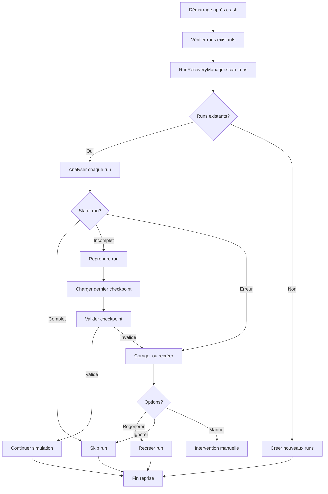

# Error Handling and Recovery - Pompier-Risques-BMAD

**Version:** v1  
**Date:** 28 Janvier 2026  
**Auteur:** Architect (Winston)  
**Statut:** Validé

---

## Vue d'Ensemble

Ce document décrit la stratégie complète de gestion d'erreurs et de reprise après crash pour éviter les pertes de données lors des 50 runs.

**Objectif:** Éviter pertes de données et permettre reprise après crash/erreur lors des 50 runs.

**Principes:**
- ✅ **Checkpoints réguliers:** Sauvegarde état tous les N jours (configurable)
- ✅ **Retry automatique:** Retry avec backoff pour erreurs transitoires
- ✅ **État d'erreur:** Sauvegarde état même en cas d'erreur pour diagnostic
- ✅ **Reprise automatique:** Détection runs incomplets au démarrage

---

## Composants Principaux

### 1. CheckpointManager

**Responsabilité:** Gestion des checkpoints pour reprise après crash.

```python
# src/core/state/checkpoint_manager.py
from typing import Optional
from pathlib import Path
import pickle
import logging
from datetime import datetime
import json

class CheckpointManager:
    """Gère les checkpoints pour reprise après crash."""
    
    def __init__(self, run_id: str, checkpoint_dir: Path, interval_days: int = 10):
        self.run_id = run_id
        self.checkpoint_dir = checkpoint_dir
        self.interval_days = interval_days
        self.checkpoint_dir.mkdir(parents=True, exist_ok=True)
    
    def should_checkpoint(self, day: int) -> bool:
        """Détermine si un checkpoint est nécessaire."""
        return day % self.interval_days == 0 or day == 1
    
    def save_checkpoint(self, state: SimulationState, day: int) -> Path:
        """Sauvegarde un checkpoint."""
        checkpoint_path = self.checkpoint_dir / f"checkpoint_day_{day:04d}.pkl"
        
        try:
            with open(checkpoint_path, 'wb') as f:
                pickle.dump(state, f)
            
            # Sauvegarde métadonnées
            metadata = {
                'run_id': state.run_id,
                'day': day,
                'timestamp': datetime.now().isoformat()
            }
            metadata_path = checkpoint_path.with_suffix('.json')
            with open(metadata_path, 'w') as f:
                json.dump(metadata, f)
            
            logging.info(f"Checkpoint sauvegardé: {checkpoint_path}")
            return checkpoint_path
        except Exception as e:
            logging.error(f"Erreur sauvegarde checkpoint: {e}")
            raise
    
    def find_latest_checkpoint(self) -> Optional[Path]:
        """Trouve le dernier checkpoint disponible."""
        checkpoints = sorted(
            self.checkpoint_dir.glob("checkpoint_day_*.pkl"),
            key=lambda p: int(p.stem.split('_')[-1])
        )
        return checkpoints[-1] if checkpoints else None
    
    def load_checkpoint(self, checkpoint_path: Path) -> SimulationState:
        """Charge un checkpoint."""
        try:
            with open(checkpoint_path, 'rb') as f:
                state = pickle.load(f)
            logging.info(f"Checkpoint chargé: {checkpoint_path}")
            return state
        except Exception as e:
            logging.error(f"Erreur chargement checkpoint: {e}")
            raise
```

---

### 2. ErrorHandler

**Responsabilité:** Gestion et classification des erreurs avec stratégies de récupération.

```python
# src/core/errors/error_handler.py
from enum import Enum
from typing import Optional
import logging
from src.core.state import SimulationState

class ErrorType(Enum):
    """Types d'erreurs."""
    PICKLE_CORRUPTED = "pickle_corrupted"
    MISSING_DATA = "missing_data"
    CALCULATION_ERROR = "calculation_error"
    MEMORY_ERROR = "memory_error"
    TIMEOUT = "timeout"
    GENERIC = "generic"

class ErrorHandler:
    """Gère les erreurs avec stratégies de récupération."""
    
    def __init__(self, max_retries: int = 3):
        self.max_retries = max_retries
        self.retry_strategies = {
            ErrorType.PICKLE_CORRUPTED: self._retry_with_backup,
            ErrorType.MISSING_DATA: self._regenerate_data,
            ErrorType.CALCULATION_ERROR: self._skip_day,
            ErrorType.MEMORY_ERROR: self._save_and_stop,
            ErrorType.TIMEOUT: self._retry_with_backoff,
        }
    
    def handle_error(
        self,
        error: Exception,
        context: dict,
        state: Optional[SimulationState] = None
    ) -> dict:
        """
        Gère une erreur et retourne action à prendre.
        
        Returns:
            dict avec 'action', 'retry', 'state', 'message'
        """
        error_type = self._classify_error(error)
        logging.error(f"Erreur {error_type.value}: {error}", exc_info=True)
        
        strategy = self.retry_strategies.get(error_type, self._default_strategy)
        return strategy(error, context, state)
    
    def _classify_error(self, error: Exception) -> ErrorType:
        """Classifie le type d'erreur."""
        error_str = str(error).lower()
        
        if 'pickle' in error_str or 'unpickling' in error_str:
            return ErrorType.PICKLE_CORRUPTED
        elif 'file not found' in error_str or 'missing' in error_str:
            return ErrorType.MISSING_DATA
        elif 'memory' in error_str or 'MemoryError' in type(error).__name__:
            return ErrorType.MEMORY_ERROR
        elif 'timeout' in error_str:
            return ErrorType.TIMEOUT
        elif 'calculation' in error_str or 'math' in error_str:
            return ErrorType.CALCULATION_ERROR
        else:
            return ErrorType.GENERIC
    
    def _retry_with_backup(self, error: Exception, context: dict, state: Optional[SimulationState]) -> dict:
        """Retry avec fichier backup."""
        retry_count = context.get('retry_count', 0)
        if retry_count < self.max_retries:
            backup_path = context.get('backup_path')
            if backup_path and backup_path.exists():
                return {
                    'action': 'retry',
                    'retry': True,
                    'backup_path': backup_path,
                    'message': f"Retry avec backup (tentative {retry_count + 1}/{self.max_retries})"
                }
        return {
            'action': 'save_and_stop',
            'retry': False,
            'message': f"Échec après {self.max_retries} tentatives"
        }
    
    def _regenerate_data(self, error: Exception, context: dict, state: Optional[SimulationState]) -> dict:
        """Tente de régénérer les données manquantes."""
        missing_data = context.get('missing_data')
        if missing_data == 'precomputed':
            return {
                'action': 'alert_user',
                'retry': False,
                'message': "Données pré-calculées manquantes. Lancez run_precompute.py"
            }
        return {
            'action': 'skip_day',
            'retry': False,
            'message': "Données manquantes, skip jour"
        }
    
    def _skip_day(self, error: Exception, context: dict, state: Optional[SimulationState]) -> dict:
        """Skip le jour en cours et continue."""
        return {
            'action': 'skip_day',
            'retry': False,
            'message': "Erreur calcul, skip jour"
        }
    
    def _save_and_stop(self, error: Exception, context: dict, state: Optional[SimulationState]) -> dict:
        """Sauvegarde état et arrête."""
        return {
            'action': 'save_and_stop',
            'retry': False,
            'state': state,
            'message': "Erreur critique, état sauvegardé"
        }
    
    def _retry_with_backoff(self, error: Exception, context: dict, state: Optional[SimulationState]) -> dict:
        """Retry avec backoff exponentiel."""
        retry_count = context.get('retry_count', 0)
        if retry_count < self.max_retries:
            import time
            backoff = 2 ** retry_count  # 1s, 2s, 4s
            time.sleep(backoff)
            return {
                'action': 'retry',
                'retry': True,
                'backoff': backoff,
                'message': f"Retry après {backoff}s (tentative {retry_count + 1})"
            }
        return {
            'action': 'save_and_stop',
            'retry': False,
            'message': "Timeout après retries"
        }
    
    def _default_strategy(self, error: Exception, context: dict, state: Optional[SimulationState]) -> dict:
        """Stratégie par défaut."""
        return {
            'action': 'save_and_stop',
            'retry': False,
            'message': f"Erreur non gérée: {error}"
        }
```

---

### 3. RunRecoveryManager

**Responsabilité:** Détection et reprise des runs incomplets au démarrage.

```python
# src/services/run_recovery_manager.py
from pathlib import Path
from typing import Dict, Optional
import json
from src.core.state.checkpoint_manager import CheckpointManager
from src.core.state.simulation_state import SimulationState

class RunRecoveryManager:
    """Gère la reprise des runs après crash."""
    
    def __init__(self, intermediate_dir: Path):
        self.intermediate_dir = intermediate_dir
    
    def scan_runs(self) -> Dict[str, str]:
        """
        Scanne les runs existants et retourne leur statut.
        
        Returns:
            Dict[run_id, status] où status = 'complete'|'incomplete'|'error'
        """
        runs_status = {}
        
        for run_dir in self.intermediate_dir.glob("run_*"):
            run_id = run_dir.name
            status = self._check_run_status(run_dir)
            runs_status[run_id] = status
        
        return runs_status
    
    def _check_run_status(self, run_dir: Path) -> str:
        """Vérifie le statut d'un run."""
        trace_file = run_dir / "trace.json"
        
        if not trace_file.exists():
            return 'incomplete'
        
        try:
            with open(trace_file, 'r') as f:
                trace = json.load(f)
            
            jours_simules = trace.get('statistiques', {}).get('jours_simules', 0)
            jours_attendus = trace.get('parameters', {}).get('nombre_jours', 365)
            
            if jours_simules >= jours_attendus:
                return 'complete'
            else:
                return 'incomplete'
        except Exception:
            return 'error'
    
    def recover_run(self, run_id: str) -> Optional[SimulationState]:
        """Récupère un run incomplet."""
        run_dir = self.intermediate_dir / run_id
        checkpoint_dir = run_dir / "checkpoints"
        
        if not checkpoint_dir.exists():
            return None
        
        checkpoint_mgr = CheckpointManager(run_id, checkpoint_dir)
        latest_checkpoint = checkpoint_mgr.find_latest_checkpoint()
        
        if latest_checkpoint:
            return checkpoint_mgr.load_checkpoint(latest_checkpoint)
        
        return None
```

---

## Intégration dans SimulationService

```python
# src/services/simulation_service.py (modifié)
import logging
from src.core.state.checkpoint_manager import CheckpointManager
from src.core.errors.error_handler import ErrorHandler, ErrorType

class SimulationService:
    def __init__(
        self,
        # ... autres dépendances ...
        checkpoint_manager: CheckpointManager,
        error_handler: ErrorHandler
    ):
        # ...
        self.checkpoint_manager = checkpoint_manager
        self.error_handler = error_handler
        self._retry_count = 0
    
    def run_day(self, day: int) -> None:
        """Orchestre un jour de simulation avec gestion d'erreurs."""
        try:
            # ... simulation normale ...
            
            # Checkpoint si nécessaire
            if self.checkpoint_manager.should_checkpoint(day):
                self.checkpoint_manager.save_checkpoint(self.state, day)
        
        except Exception as e:
            # Gestion erreur
            context = {
                'day': day,
                'run_id': self.state.run_id,
                'retry_count': self._retry_count
            }
            
            result = self.error_handler.handle_error(e, context, self.state)
            
            if result['action'] == 'retry' and result.get('retry'):
                self._retry_count = context['retry_count'] + 1
                return self.run_day(day)  # Retry
            elif result['action'] == 'skip_day':
                logging.warning(f"Jour {day} skippé: {result['message']}")
                return
            elif result['action'] == 'save_and_stop':
                # Sauvegarde état d'erreur
                self.checkpoint_manager.save_checkpoint(self.state, day)
                raise RuntimeError(f"Simulation arrêtée: {result['message']}")
            elif result['action'] == 'alert_user':
                raise UserWarning(f"Action requise: {result['message']}")
```

---

## Types d'Erreurs Gérées

| Type d'Erreur | Détection | Stratégie | Action |
|---------------|-----------|-----------|--------|
| **Pickle corrompu** | `pickle` ou `unpickling` dans message | Retry avec backup (max 3 fois) | Retry ou sauvegarde + arrêt |
| **Données manquantes** | `file not found` ou `missing` | Alerte utilisateur ou skip jour | Alerte ou skip |
| **Erreur calcul** | `calculation` ou `math` | Skip jour + log | Continue simulation |
| **Erreur mémoire** | `MemoryError` ou `memory` | Sauvegarde + arrêt | État sauvegardé, arrêt |
| **Timeout** | `timeout` | Retry avec backoff exponentiel | Retry (1s, 2s, 4s) ou arrêt |
| **Générique** | Autre | Sauvegarde + arrêt | État sauvegardé, arrêt |

---

## Flux de Reprise



---

## Configuration

**Intervalle checkpoints:** Configurable dans `config.yaml`:

```yaml
simulation:
  checkpoint_interval_days: 10  # Checkpoint tous les 10 jours
  max_retries: 3                 # Max 3 tentatives retry
```

---

**Fin du document**
