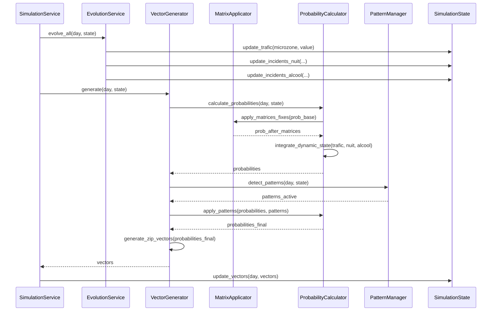

# Analyse d'Impact Architectural : Découpage Story 1.4.4

**Date :** 29 Janvier 2026  
**Auteur :** Architect (Winston)  
**Contexte :** Analyse de l'impact du découpage Story 1.4.4 en 6 sous-stories sur l'architecture actuelle

---

## 📋 Résumé Exécutif

Le découpage proposé par l'Orchestrator clarifie **significativement** l'architecture en séparant :
1. **Pré-calculs** (matrices fixes) vs **Runtime** (variables d'état, patterns)
2. **Détection** (patterns) vs **Application** (modulation probabilités)
3. **3 dataframes distincts** : vecteurs, nuit/alcool, congestion route

**Impact architectural :** **Moyen à Élevé** - Nécessite des ajustements structurels mais **renforce** la modularité et la testabilité.

---

## 🎯 Changements Architecturaux Identifiés

### 1. Séparation Pré-calculs / Runtime

#### État Actuel
- Les matrices de corrélation sont mentionnées dans l'architecture mais pas clairement séparées entre pré-calculs et runtime
- Le script `precompute_matrices_correlation.py` existe mais n'est pas intégré dans la structure architecturale

#### Impact du Découpage
**Story 1.4.4.1** clarifie que **toutes les matrices fixes** doivent être **pré-calculées** et stockées dans `data/source_data/` :

```
scripts/
├── precompute_matrices_correlation.py  # Story 1.4.4.1
│   ├── Matrices intra-type (3×3)
│   ├── Matrices inter-type
│   ├── Matrices voisin (8 microzones)
│   ├── Matrices saisonnalité
│   ├── Matrices trafic (règles de transition)
│   └── Matrices alcool/nuit (probabilités de base)
```

**Modification architecturale requise :**
- ✅ **Ajouter section "Pré-calculs Matrices"** dans `docs/architecture.md`
- ✅ **Clarifier que les matrices fixes sont des données pré-calculées**, pas du code runtime
- ✅ **Documenter l'interface de chargement** (DataLoaderAdapter doit charger les matrices pickle)

---

### 2. Nouveaux Modules Core Domain

#### Modules à Créer

**Story 1.4.4.2 : Évolution Variables d'État**
```
src/core/evolution/
├── __init__.py
├── trafic_evolution.py      # evoluer_trafic_J1()
├── nuit_evolution.py        # evoluer_incidents_nuit_J1()
└── alcool_evolution.py      # evoluer_incidents_alcool_J1()
```

**Story 1.4.4.3 : Application Matrices Fixes**
```
src/core/probability/
├── __init__.py
├── matrix_applicator.py     # Application matrices fixes
│   ├── apply_intra_type()
│   ├── apply_inter_type()
│   ├── apply_voisin()
│   └── apply_saisonnalite()
└── probability_calculator.py  # calculer_probabilite_incidents_J1()
```

**Story 1.4.4.4 : Intégration Variables d'État**
- ✅ **Mise à jour de `probability_calculator.py`** pour intégrer variables d'état

**Story 1.4.4.5 : Détection Patterns**
```
src/core/patterns/
├── __init__.py
├── pattern_detector.py      # Détection 4j→7j, 60j
│   ├── detect_pattern_4j()
│   ├── detect_pattern_60j()
│   └── create_pattern_7j()
└── pattern_manager.py      # Gestion cycle de vie, limitation 3 max
```

**Story 1.4.4.6 : Application Patterns**
- ✅ **Mise à jour de `probability_calculator.py`** pour intégrer patterns

**Modification architecturale requise :**
- ✅ **Mettre à jour la section "Core Domain"** dans `docs/architecture.md` avec ces nouveaux modules
- ✅ **Clarifier la séparation** : `src/core/evolution/` (variables d'état) vs `src/core/probability/` (calcul probabilités) vs `src/core/patterns/` (détection/gestion)

---

### 3. Structure SimulationState : Variables d'État Dynamiques

#### État Actuel
`SimulationState` contient :
- `vectors_state` : Vecteurs journaliers
- `events_state` : Événements
- `casualties_state` : Morts/blessés
- `regime_state` : Régimes cachés

#### Impact du Découpage
**Story 1.4.4.2** nécessite d'ajouter un nouveau domaine composant :

```python
# src/core/state/simulation_state.py
class SimulationState:
    def __init__(self, run_id: str, config: dict):
        # ... existant ...
        
        # NOUVEAU : Variables d'état dynamiques
        self.dynamic_state = DynamicState()  # Story 1.4.4.2
```

**Nouveau domaine composant :**
```python
# src/core/state/dynamic_state.py
class DynamicState:
    """Gestion variables d'état dynamiques (trafic, incidents nuit, incidents alcool)."""
    
    def __init__(self):
        # Trafic : niveau congestion par microzone (0-1)
        self.trafic: Dict[str, float] = {}  # {microzone_id: niveau_congestion}
        
        # Incidents nuit : nombre par type par microzone
        self.incidents_nuit: Dict[str, Dict[str, int]] = {}  # {microzone_id: {type: count}}
        
        # Incidents alcool : nombre par type par microzone
        self.incidents_alcool: Dict[str, Dict[str, int]] = {}  # {microzone_id: {type: count}}
    
    def update_trafic(self, microzone_id: str, trafic_value: float) -> None:
        """Met à jour le niveau de trafic pour une microzone."""
        self.trafic[microzone_id] = max(0.0, min(1.0, trafic_value))
    
    def update_incidents_nuit(self, microzone_id: str, type_incident: str, count: int) -> None:
        """Met à jour le nombre d'incidents nuit."""
        if microzone_id not in self.incidents_nuit:
            self.incidents_nuit[microzone_id] = {}
        self.incidents_nuit[microzone_id][type_incident] = count
    
    def update_incidents_alcool(self, microzone_id: str, type_incident: str, count: int) -> None:
        """Met à jour le nombre d'incidents alcool."""
        if microzone_id not in self.incidents_alcool:
            self.incidents_alcool[microzone_id] = {}
        self.incidents_alcool[microzone_id][type_incident] = count
```

**Modification architecturale requise :**
- ✅ **Mettre à jour `docs/architecture/simulation-state.md`** avec `DynamicState`
- ✅ **Documenter les 3 dataframes** : vecteurs, nuit/alcool, congestion route

---

### 4. Flux J→J+1 Clarifié

#### État Actuel
Le flux J→J+1 dans `docs/architecture.md` mentionne la génération de vecteurs mais ne détaille pas l'ordre des opérations avec matrices et variables d'état.

#### Impact du Découpage
**Le diagramme de flux est maintenant explicite** (voir `story/1.4.4-DIAGRAMME-DECOUPAGE.md`) :

```
JOUR J
  ↓
1. Évolution Variables d'État (Story 1.4.4.2)
  ↓
2. Calcul Probabilités (Stories 1.4.4.3 + 1.4.4.4)
  - Application matrices fixes
  - Intégration variables d'état
  ↓
3. Détection Patterns (Story 1.4.4.5)
  ↓
4. Application Patterns (Story 1.4.4.6)
  ↓
5. Génération Incidents (Story 2.2.1)
  ↓
JOUR J+1
```

**Modification architecturale requise :**
- ✅ **Mettre à jour le diagramme de flux** dans `docs/architecture.md` (section "Data Flow")
- ✅ **Clarifier l'ordre des opérations** dans `SimulationService.run_day()`

---

### 5. Vector Generator : Intégration Matrices et Variables

#### État Actuel
`VectorGenerator` génère des vecteurs selon Zero-Inflated Poisson avec régimes cachés, mais l'intégration des matrices et variables d'état n'est pas détaillée.

#### Impact du Découpage
**Le `VectorGenerator` doit maintenant utiliser :**
1. **Matrices fixes** (chargées depuis pickle)
2. **Variables d'état évoluées** (depuis `DynamicState`)
3. **Patterns actifs** (depuis `PatternManager`)

**Nouvelle signature :**
```python
# src/core/generation/vector_generator.py
class ZeroInflatedPoissonGenerator(VectorGenerator):
    def __init__(
        self,
        regime_manager: RegimeManager,
        pattern_manager: PatternManager,
        static_vectors: Dict,
        # NOUVEAU
        matrix_applicator: MatrixApplicator,  # Story 1.4.4.3
        probability_calculator: ProbabilityCalculator,  # Stories 1.4.4.3 + 1.4.4.4
        evolution_service: EvolutionService  # Story 1.4.4.2
    ):
        # ...
    
    def generate(self, day: int, state: SimulationState) -> Dict:
        # 1. ÉVOLUTION VARIABLES D'ÉTAT (Story 1.4.4.2)
        self.evolution_service.evolve_all(state.dynamic_state, day, state)
        
        # 2. CALCUL PROBABILITÉS (Stories 1.4.4.3 + 1.4.4.4)
        probabilities = self.probability_calculator.calculate(
            day, state, state.dynamic_state
        )
        
        # 3. DÉTECTION PATTERNS (Story 1.4.4.5)
        patterns = self.pattern_manager.detect_patterns(day, state)
        
        # 4. APPLICATION PATTERNS (Story 1.4.4.6)
        probabilities = self.probability_calculator.apply_patterns(
            probabilities, patterns, day
        )
        
        # 5. GÉNÉRATION VECTEURS (Zero-Inflated Poisson)
        vectors = self._generate_zip_vectors(probabilities, state)
        
        return vectors
```

**Modification architecturale requise :**
- ✅ **Mettre à jour la section "Vector Generator"** dans `docs/architecture.md`
- ✅ **Documenter les dépendances** : MatrixApplicator, ProbabilityCalculator, EvolutionService

---

### 6. DataLoaderAdapter : Chargement Matrices

#### État Actuel
`DataLoaderAdapter` charge microzones, distances, vecteurs statiques, prix m².

#### Impact du Découpage
**Story 1.4.4.1** nécessite de charger **6 types de matrices** :

```python
# src/adapters/data_loader/pickle_loader.py
class PickleDataLoader(DataLoaderAdapter):
    def load_matrices_correlation(self) -> Dict:
        """Charge toutes les matrices de corrélation pré-calculées."""
        return {
            'intra_type': self._load_pickle('matrices_correlation_intra_type.pkl'),
            'inter_type': self._load_pickle('matrices_correlation_inter_type.pkl'),
            'voisin': self._load_pickle('matrices_voisin.pkl'),
            'saisonnalite': self._load_pickle('matrices_saisonnalite.pkl'),
            'trafic': self._load_pickle('matrices_trafic.pkl'),
            'alcool_nuit': self._load_pickle('matrices_alcool_nuit.pkl')
        }
```

**Modification architecturale requise :**
- ✅ **Documenter le chargement des matrices** dans la section "Adapters"
- ✅ **Clarifier l'interface** : les matrices sont passées au `MatrixApplicator` via constructeur

---

## 📊 Impact sur les Composants Existants

### SimulationService

**Modifications nécessaires :**
```python
# src/services/simulation_service.py
class SimulationService:
    def __init__(
        self,
        vector_generator: VectorGenerator,
        # ... existant ...
        # NOUVEAU
        evolution_service: EvolutionService,  # Story 1.4.4.2
        matrix_applicator: MatrixApplicator,  # Story 1.4.4.3
        probability_calculator: ProbabilityCalculator,  # Stories 1.4.4.3 + 1.4.4.4
        pattern_manager: PatternManager  # Stories 1.4.4.5 + 1.4.4.6
    ):
        # ...
    
    def run_day(self, day: int) -> None:
        # ORDRE CLARIFIÉ PAR LE DÉCOUPAGE :
        
        # 1. Évolution variables d'état (Story 1.4.4.2)
        self.evolution_service.evolve_all(self.state.dynamic_state, day, self.state)
        
        # 2. Génération vecteurs (utilise matrices + variables + patterns)
        vectors = self.vector_generator.generate(day, self.state)
        self.state.update_vectors(day, vectors)
        
        # 3. Détection patterns (Story 1.4.4.5)
        patterns = self.pattern_manager.detect_patterns(day, self.state)
        self.state.update_patterns(day, patterns)
        
        # ... reste inchangé (Golden Hour, événements, etc.)
```

---

## 🏗️ Nouvelle Structure de Répertoires

### Structure Proposée

```
src/
├── core/
│   ├── generation/
│   │   ├── vector_generator.py      # Modifié : utilise matrices + variables
│   │   ├── regime_manager.py
│   │   └── intensity_calculator.py
│   ├── evolution/                    # NOUVEAU (Story 1.4.4.2)
│   │   ├── __init__.py
│   │   ├── trafic_evolution.py
│   │   ├── nuit_evolution.py
│   │   └── alcool_evolution.py
│   ├── probability/                  # NOUVEAU (Stories 1.4.4.3 + 1.4.4.4)
│   │   ├── __init__.py
│   │   ├── matrix_applicator.py
│   │   └── probability_calculator.py
│   ├── patterns/                    # MODIFIÉ (Stories 1.4.4.5 + 1.4.4.6)
│   │   ├── __init__.py
│   │   ├── pattern_detector.py      # NOUVEAU
│   │   ├── pattern_manager.py       # MODIFIÉ
│   │   ├── pattern_4j.py
│   │   ├── pattern_7j.py
│   │   └── pattern_60j.py
│   ├── state/
│   │   ├── simulation_state.py      # MODIFIÉ : ajout DynamicState
│   │   ├── vectors_state.py
│   │   ├── events_state.py
│   │   ├── casualties_state.py
│   │   ├── regime_state.py
│   │   └── dynamic_state.py         # NOUVEAU (Story 1.4.4.2)
│   ├── golden_hour/
│   └── events/
├── services/
│   ├── simulation_service.py        # MODIFIÉ : ordre opérations clarifié
│   └── ...
└── adapters/
    ├── data_loader/
    │   └── pickle_loader.py         # MODIFIÉ : chargement matrices
    └── ...
```

---

## 🔄 Flux de Données J→J+1 (Mise à Jour)

### Diagramme de Séquence Mise à Jour



---

## ✅ Checklist des Modifications Architecturales

### Documentation

- [ ] **Mettre à jour `docs/architecture.md`** :
  - [ ] Section "Pré-calculs Matrices" (Story 1.4.4.1)
  - [ ] Section "Core Domain" avec nouveaux modules (evolution/, probability/)
  - [ ] Section "SimulationState" avec `DynamicState`
  - [ ] Section "Vector Generator" avec intégration matrices/variables
  - [ ] Section "Data Flow" avec ordre opérations clarifié
  - [ ] Section "Adapters" avec chargement matrices

- [ ] **Mettre à jour `docs/architecture/simulation-state.md`** :
  - [ ] Ajout `DynamicState` avec structure complète
  - [ ] Documentation des 3 dataframes (vecteurs, nuit/alcool, congestion)

- [ ] **Créer `docs/architecture/matrices-integration.md`** (optionnel) :
  - [ ] Flux complet matrices fixes → probabilités
  - [ ] Interface MatrixApplicator
  - [ ] Interface ProbabilityCalculator

### Code Structure

- [ ] **Créer `src/core/evolution/`** (Story 1.4.4.2)
- [ ] **Créer `src/core/probability/`** (Stories 1.4.4.3 + 1.4.4.4)
- [ ] **Créer `src/core/state/dynamic_state.py`** (Story 1.4.4.2)
- [ ] **Modifier `src/core/patterns/`** (Stories 1.4.4.5 + 1.4.4.6)
- [ ] **Modifier `src/core/generation/vector_generator.py`** (intégration)
- [ ] **Modifier `src/services/simulation_service.py`** (ordre opérations)
- [ ] **Modifier `src/adapters/data_loader/pickle_loader.py`** (chargement matrices)

---

## 🎯 Bénéfices Architecturaux du Découpage

### 1. **Modularité Renforcée**
- ✅ Séparation claire : pré-calculs vs runtime
- ✅ Modules indépendants testables
- ✅ Responsabilités uniques par module

### 2. **Testabilité Améliorée**
- ✅ Chaque story testable indépendamment
- ✅ Mocking facilité (interfaces claires)
- ✅ Tests d'intégration progressifs

### 3. **Maintenabilité**
- ✅ Modifications isolées (changer une matrice n'affecte pas les patterns)
- ✅ Code modulaire et réutilisable
- ✅ Documentation claire par story

### 4. **Extensibilité**
- ✅ Ajout nouvelles matrices facile (Story 1.4.4.1)
- ✅ Ajout nouvelles variables d'état facile (Story 1.4.4.2)
- ✅ Ajout nouveaux patterns facile (Story 1.4.4.5)

---

## ⚠️ Points d'Attention

### 1. **Ordre d'Implémentation**
Respecter strictement l'ordre des stories (1.4.4.1 → 1.4.4.2 → ... → 1.4.4.6) pour éviter dépendances circulaires.

### 2. **Interfaces Entre Modules**
Définir clairement les contrats (types Python, formats pickle) dès Story 1.4.4.1 pour éviter refactoring.

### 3. **Performance**
Vérifier que le découpage n'impacte pas les performances (0.33s/jour cible). Les matrices pré-calculées doivent être chargées une seule fois au démarrage.

### 4. **Tests de Non-Régression**
Après chaque story, vérifier que les stories précédentes fonctionnent toujours.

---

## 📝 Conclusion

Le découpage proposé par l'Orchestrator **améliore significativement** l'architecture en :
- ✅ Clarifiant la séparation pré-calculs/runtime
- ✅ Créant des modules testables et maintenables
- ✅ Définissant un flux J→J+1 explicite
- ✅ Documentant les 3 dataframes (vecteurs, nuit/alcool, congestion)

**Impact :** Modifications structurelles nécessaires mais **bénéfiques** pour la maintenabilité et l'extensibilité à long terme.

**Recommandation :** ✅ **Valider le découpage et procéder aux modifications architecturales** avant l'implémentation des stories.

---

**Document créé le :** 29 Janvier 2026  
**Version :** 1.0  
**Auteur :** Architect (Winston)
