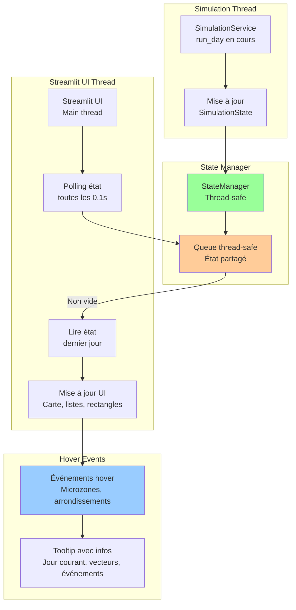

# UI Réactive - Pompier-Risques-BMAD

**Version:** v1  
**Date:** 28 Janvier 2026  
**Auteur:** Architect (Winston)  
**Statut:** Validé

---

## Vue d'Ensemble

Ce document décrit l'architecture UI réactive permettant l'interaction (hover, tooltips) pendant la simulation en cours.

**Objectif:** Permettre interaction UI (hover, tooltips) pendant simulation en cours.

**Approche:** StateManager thread-safe avec polling non-bloquant.

---

## StateManager Thread-Safe

**Responsabilité:** Gestion état partagé entre simulation thread et UI thread.

```python
# src/adapters/ui/state_manager.py
from threading import Lock
from queue import Queue
from typing import Optional
import time
from src.core.state.simulation_state import SimulationState

class StateManager:
    """Gère l'état partagé thread-safe pour UI réactive."""
    
    def __init__(self):
        self._state: Optional[SimulationState] = None
        self._lock = Lock()
        self._update_queue = Queue()
        self._last_update = time.time()
    
    def update_state(self, state: SimulationState) -> None:
        """Met à jour l'état (appelé par simulation thread)."""
        with self._lock:
            self._state = state
            self._last_update = time.time()
            self._update_queue.put(('state_update', state))
    
    def get_state(self) -> Optional[SimulationState]:
        """Récupère l'état actuel (appelé par UI thread)."""
        with self._lock:
            return self._state
    
    def get_state_snapshot(self) -> dict:
        """Récupère un snapshot de l'état pour UI (léger, thread-safe)."""
        with self._lock:
            if self._state is None:
                return {}
            
            return {
                'current_day': self._state.current_day,
                'run_id': self._state.run_id,
                'vectors_summary': self._get_vectors_summary(),
                'events_summary': self._get_events_summary(),
                'last_update': self._last_update
            }
    
    def _get_vectors_summary(self) -> dict:
        """Résumé des vecteurs pour tooltip."""
        if not self._state:
            return {}
        
        # Agrégation rapide pour tooltip
        total_incidents = 0
        for day_data in self._state.vectors_state.vectors.values():
            for microzone_data in day_data.values():
                for vector in microzone_data.values():
                    total_incidents += sum(vector)
        
        return {'total_incidents': total_incidents}
    
    def _get_events_summary(self) -> dict:
        """Résumé des événements pour tooltip."""
        if not self._state:
            return {}
        
        active_events = self._state.events_state.get_active_events(
            self._state.current_day
        )
        
        return {
            'graves': len(active_events['graves']),
            'positifs': len(active_events['positifs'])
        }
```

---

## Intégration Streamlit

**Approche:** Polling non-bloquant avec `st.rerun()` périodique.

```python
# src/adapters/ui/streamlit_app.py (modifié)
import streamlit as st
import time
import folium
from src.adapters.ui.state_manager import StateManager

class StreamlitApp:
    def __init__(self, state_manager: StateManager):
        self.state_manager = state_manager
        self._simulation_thread: Optional[Thread] = None
    
    def run(self):
        """Lance l'application Streamlit."""
        st.title("Simulation Risques BSPP")
        
        # Initialisation state manager dans session
        if 'state_manager' not in st.session_state:
            st.session_state.state_manager = self.state_manager
        
        # Layout
        col_left, col_center, col_right = st.columns([1, 2, 1])
        
        with col_center:
            # Carte avec tooltips réactifs
            self._render_map()
        
        # Polling pour mise à jour UI (non-bloquant)
        if st.session_state.get('simulation_running', False):
            time.sleep(0.1)  # Polling toutes les 0.1s
            st.rerun()  # Force refresh UI
    
    def _render_map(self):
        """Rend la carte avec tooltips réactifs."""
        snapshot = self.state_manager.get_state_snapshot()
        
        if not snapshot:
            st.info("En attente de démarrage...")
            return
        
        # Carte Folium
        m = folium.Map(location=[48.8566, 2.3522], zoom_start=12)
        
        # Ajout microzones avec tooltips
        for microzone_id, geometry in microzones.items():
            # Récupération données pour tooltip (thread-safe)
            tooltip_data = self._get_tooltip_data(microzone_id, snapshot)
            
            # Popup avec infos en temps réel
            popup = folium.Popup(
                f"""
                <b>Microzone {microzone_id}</b><br>
                Jour: {snapshot['current_day']}<br>
                Incidents: {tooltip_data.get('incidents', 0)}<br>
                Régime: {tooltip_data.get('regime', 'N/A')}
                """,
                max_width=200
            )
            
            folium.GeoJson(
                geometry,
                tooltip=f"Microzone {microzone_id}",
                popup=popup
            ).add_to(m)
        
        st.folium_static(m, width=700, height=500)
    
    def _get_tooltip_data(self, microzone_id: str, snapshot: dict) -> dict:
        """Récupère données pour tooltip (lecture thread-safe)."""
        state = self.state_manager.get_state()
        if not state:
            return {}
        
        # Lecture thread-safe
        with self.state_manager._lock:
            regime = state.regime_state.get_regime(microzone_id)
            vectors = state.vectors_state.get_vectors(
                snapshot['current_day'], microzone_id
            )
            
            total_incidents = 0
            for vector in vectors.values():
                total_incidents += sum(vector)
        
        return {
            'regime': regime,
            'incidents': total_incidents
        }
```

---

## Architecture Thread-Safe



---

## Performance

**Polling:** 0.1s (10 fois par seconde) - suffisant pour réactivité sans surcharge CPU.

**Thread-safety:** Lock pour toutes les opérations de lecture/écriture sur l'état partagé.

---

**Fin du document**
